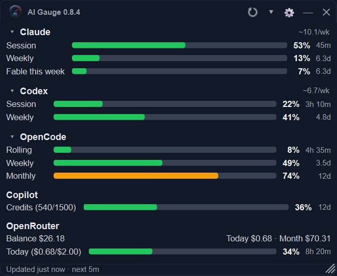
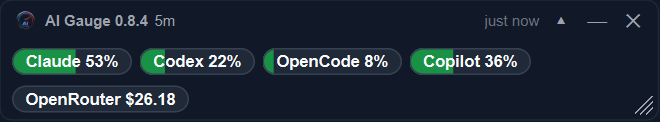

<p align="center">
  
</p>

<h1 align="center">AI Gauge</h1>

<p align="center"><strong>Know your AI usage at a glance.</strong></p>

<p align="center">
  <a href="https://github.com/jpajak/ai-gauge/actions/workflows/test.yml"></a>
  
  
  
</p>

AI Gauge is a compact desktop monitor for **Claude.ai**, **ChatGPT Codex**,
**OpenCode Go**, **GitHub Copilot**, and **OpenRouter**. It shows usage limits,
reset times, balances, and spend at a glance. Optional local tracking estimates
the API-equivalent cost of Claude Code and Codex activity on this computer.

- **Windows / Linux** — always-on-top draggable frameless widget plus a system-tray icon.
- **macOS** — Stats-style menu-bar item (`● Cl 42% ● Cx 78% ● Co 15%`); the panel opens as a popover when you click it.

> **Requires Python 3.11+.** Secrets live in the OS-native credential store (Windows Credential Manager / DPAPI, macOS Keychain, Linux Secret Service). Auto-start uses the platform's standard mechanism (Windows Task Scheduler / LaunchAgent / `~/.config/autostart`).

Current version: **0.8.4**. See [CHANGELOG.md](CHANGELOG.md) for release notes.

AI Gauge is an independent open-source project and unofficial local desktop
utility. It is not affiliated with Anthropic, OpenAI, GitHub, Microsoft,
OpenRouter, or any other provider. Provider pages and APIs may change without
notice.

## Screenshots

**Windows / Linux** — always-on-top floating widget in full and compact modes:

<p align="center">
  
  &nbsp;&nbsp;
  
</p>

**macOS** — native menu-bar usage summary:

<p align="center">
  
</p>

## Download

Pre-built binaries for each release are published on the [Releases page](https://github.com/jpajak/ai-gauge/releases). Pick the archive for your OS, extract, and run:

| OS      | Archive                              | Run                                |
| ------- | ------------------------------------ | ---------------------------------- |
| Windows | `ai-gauge-<version>-windows.zip`     | extract, run `ai-gauge.exe`        |
| macOS   | `ai-gauge-<version>-macos.tar.gz`    | extract, drag `ai-gauge.app` to Applications |
| Linux   | `ai-gauge-<version>-linux.tar.gz`    | extract, run `./ai-gauge/ai-gauge` |

SHA256 sums are published alongside each archive. Builds are unsigned - see the [first-launch warnings](#build-a-standalone-binary) section below for SmartScreen / Gatekeeper handling.

## Run from source

**Windows (PowerShell):**

```powershell
py -m venv .venv
.\.venv\Scripts\python.exe -m pip install -e .
.\.venv\Scripts\python.exe -m aigauge
```

**macOS / Linux (bash):**

```bash
python3 -m venv .venv
./.venv/bin/python -m pip install -e .
./.venv/bin/python -m aigauge
```

On first launch the widget appears with enabled provider tiles. Claude and Codex use a **Sign in** or **Paste cookie** flow; OpenCode Go, GitHub Copilot, and OpenRouter are configured from Settings with API credentials. Open Settings to disable providers you don't use or to add more Claude, Codex, or OpenCode Go accounts.

## First-time setup per provider

| Provider           | Setup                                                                                                                                                                                                                                                                                                                                                                                                                                       |
| ------------------ | ------------------------------------------------------------------------------------------------------------------------------------------------------------------------------------------------------------------------------------------------------------------------------------------------------------------------------------------------------------------------------------------------------------------------------------------- |
| **Claude.ai**      | **Sign in (recommended):** asks which installed Chrome-family browser to use, remembers that choice, supports Google and passkeys, and connects the resulting Claude session automatically. No cookie copying is required. **Paste cookie:** remains available as a recovery fallback. Add extra Claude subscriptions from **Settings → Claude**. |
| **ChatGPT Codex**  | Same as Claude — **Sign in** uses your chosen installed browser and automatically connects the ChatGPT session, including Google-linked and passkey accounts. **Paste cookie** remains available only as a fallback. Add extra Codex subscriptions from **Settings → Codex**. |
| **OpenCode Go**    | Sign in at <https://opencode.ai/auth> and copy an API key. In **Settings → OpenCode**, paste the key beside the subscription name. Each subscription has an independent key and tile. AI Gauge stores keys in the system credential store and reads Rolling, Weekly, and Monthly usage from the authenticated Go API. The shorter name **OpenCode** is used in the app. |
| **GitHub Copilot** | Create a **fine-grained PAT** at <https://github.com/settings/personal-access-tokens/new>. For personal plans, add **Account permissions → Plan → Read**. Paste into Settings; set your monthly AI credit allowance (Pro=1,500, Pro+=7,000, Max=20,000). If Copilot is billed through an organization, enter the billing org and use a token/account with org billing access and **Organization permissions → Administration → Read**. |
| **OpenRouter**     | Create an inference API key at <https://openrouter.ai/keys> and paste it into Settings. To show account balance and model activity, also create a management key at <https://openrouter.ai/settings/provisioning-keys>. Management keys cannot be used for inference; AI Gauge stores it separately and only uses it for OpenRouter management endpoints. Daily spend budget is optional.                                                    |

### Multiple Claude / Codex / OpenCode Go accounts

Claude, Codex, and OpenCode Go can track more than one subscription at a time. Open the provider's Settings tab, click **Add another**, and give the account a short name. Use **Sign in** or **Paste cookie** for each Claude or Codex row; paste the matching API key into each OpenCode row. Default accounts display as `Claude`, `Codex`, or `OpenCode`; named accounts display as `Claude (Work)`, `Codex (Account 2)`, `OpenCode (Team)`, etc. Claude and Codex accounts keep separate browser sessions, while OpenCode accounts keep separate system-keychain entries.

The **General** tab controls provider groups. Enabling Claude, Codex, or OpenCode shows every configured account in that family. Any account can be removed from its provider tab, including the original account; the **Add another** button remains available when no accounts are configured. Every account has separate credentials, widget tile state, and history records.

Use **Clear sign-in** beside an account to remove its session from AI Gauge.
This clears both the OS-protected saved cookie and the account's live embedded
browser cookies. It does not revoke sessions in other browsers or devices; use
the provider's security settings when you need to sign out everywhere.

### Optional local usage and cost

Enable **Settings → Local usage** to estimate what Claude Code and Codex
activity on this computer would cost at API prices. AI Gauge stores token
counts, model names, and timestamps locally; nothing is uploaded and the
estimates are not charges.

Open **Usage details** to compare allowance use with estimated cost, including
views by model, day, and trend. Browser chats, cloud tasks, other computers,
and logs deleted before AI Gauge imports them are not included.

### How browser sign-in works

Google does not allow OAuth sign-in inside embedded browser controls, so AI
Gauge can open Chrome, Edge, Brave, or Chromium instead. On first use it asks
which one you want and remembers the choice; change it later under **Settings →
General → Sign-in browser**. The flow is local:

1. AI Gauge creates a new temporary browser profile containing none of your
   regular browser history, extensions, cookies, or saved accounts.
2. You sign in normally in that browser window, including with Google or a
   passkey.
3. AI Gauge watches the temporary browser through a random loopback-only
   debugging port and accepts cookies only for the selected provider:
   `claude.ai` or `chatgpt.com`.
4. The provider session is copied into that AI Gauge account's persistent
   browser profile and OS-protected secret storage. Google cookies and cookies
   for unrelated sites are ignored.
5. AI Gauge closes the temporary browser, deletes its temporary profile, and
   verifies that the provider's usage page is signed in.

The small AI Gauge window shown alongside the external browser is a status and
recovery dialog, not a second active browser. The embedded webview loads only
when you choose it. If the external browser closes before authentication, AI
Gauge returns to the browser choice instead of opening the fallback on its own.
In embedded mode, a recognized session is verified automatically; **I'm signed
in** remains available as a manual fallback.

Your everyday Chrome/Edge profile is never opened or inspected. The imported
provider session remains available across AI Gauge restarts, so sign-in only
needs to be repeated when the provider expires or revokes it. The embedded
browser and manual **Paste cookie** option remain available as recovery paths.

Sessions persist between runs under the per-OS app-data directory:

| OS      | App data                                  | Secrets backend                           |
| ------- | ----------------------------------------- | ----------------------------------------- |
| Windows | `%APPDATA%/ai-gauge/`                     | Credential Manager (GitHub PAT + OpenRouter keys) + DPAPI-encrypted `secrets.dat` (cookies, since the Credential Manager blob limit is too small for ChatGPT JWTs) |
| macOS   | `~/Library/Application Support/ai-gauge/` | Login Keychain                            |
| Linux   | `~/.config/ai-gauge/`                     | Secret Service (GNOME Keyring / KWallet)  |

AI Gauge does not include telemetry or a backend service. Provider requests
are made from the local app to the configured providers. See
[SECURITY.md](SECURITY.md) for security and privacy notes.

### Paste cookie (fallback)

If automatic browser sign-in cannot start or import the provider session, you
can still copy an existing Claude or Codex session cookie into the
app manually. This is a recovery path; Google-linked and passkey accounts
should work with the normal **Sign in** button.

1. Sign into the provider in **Chrome / Edge / Firefox** as you normally do.
2. For ChatGPT, press **F12** → **Network**, reload the page, click a
   `chatgpt.com` request, and copy the full **Request Headers → Cookie:** value.
   This includes split session cookies plus companion auth cookies such as
   `__Secure-oai-is`.
3. For Claude, press **F12** → **Network**, reload `https://claude.ai/new#settings/usage`,
   click a `claude.ai` request, and copy the full **Request Headers → Cookie:**
   value. It must include `sessionKey`.
4. In the app, open the matching provider tab in Settings, click **Paste cookie**, paste the header, and Save.

## Daily use

- **Windows / Linux:** drag the floating widget to move it and use the
  bottom-right grip to resize it. Collapse it to a compact pill or hide it in
  the system tray. Right-click the widget or tray icon for the full menu. On
  desktops without a system tray, right-click the widget instead.
- **macOS:** the menu-bar item shows the highest usage for each enabled
  provider or account. Click it to open the popover.
- Settings control providers, accounts, colors, window behavior, UI scale,
  refresh timing, and start-at-login.
- Auto-refresh runs every 5 minutes while usage is changing, then backs off to
  a maximum of 60 minutes by default.

## Build a standalone binary

For most users the [pre-built downloads](#download) are easier — this section is for building locally or for maintainers cutting releases. The build machine needs Python 3.11+ and a `.venv` with `pip install -e .[dev]` already run; the resulting binary does **not** require Python on the target machine.

| OS      | Command          | Output                       |
| ------- | ---------------- | ---------------------------- |
| Windows | `.\build.ps1`    | `dist/ai-gauge/ai-gauge.exe` |
| macOS   | `./build.sh`     | `dist/ai-gauge.app`          |
| Linux   | `./build.sh`     | `dist/ai-gauge/ai-gauge`     |

Tagged commits matching `v*` automatically run [the release workflow](.github/workflows/release.yml), which builds all three platforms in CI and uploads them as a draft GitHub Release for the maintainer to publish.

Bundles are ~150-200 MB because the Chromium runtime ships inside. User data still lives outside the bundle, under the per-OS app-data directory.

For a single-file binary (slower first launch), pass `-OneFile` (PowerShell) or `--onefile` (bash). On macOS the `.app` bundle is recommended over the single-file form.

**First-launch warnings on signed-OS-bundle systems** - release artifacts are unsigned:

- **Windows:** SmartScreen -> "More info" -> "Run anyway". Windows builds include product/version metadata, but unsigned low-prevalence binaries can still trigger SmartScreen or Microsoft Defender reputation warnings.
- **macOS:** Gatekeeper blocks on first launch. Either right-click the `.app` → Open the first time, or run `xattr -dr com.apple.quarantine ai-gauge.app` once.
- **Linux:** no signing layer; just make `ai-gauge` executable if it isn't already.

See [RELEASING.md](RELEASING.md) for maintainer release steps.

## Tests

Tests need the dev extras, which the run-from-source install above omits:

```powershell
.\.venv\Scripts\python.exe -m pip install -e .[dev]     # Windows
./.venv/bin/python -m pip install -e '.[dev]'           # macOS / Linux
```

```powershell
.\.venv\Scripts\python.exe -m pytest    # Windows
./.venv/bin/python -m pytest            # macOS / Linux
```

The automated suite covers provider parsing, configuration, UI behavior,
local usage tracking, MCP guards, credential storage, and platform
integration. Live Claude and Codex browser sessions are validated manually.

## MCP usage guard

AI Gauge includes an optional local stdio MCP server that lets tools inspect
sanitized usage and cooperatively pause costly work. Enable it under
**Settings → MCP**, configure an optional pause percentage, and bind each MCP
client to its account:

```text
ai-gauge-mcp --account-id codex-work
```

Source installations also need `pip install -e '.[mcp]'`. See
[docs/mcp.md](docs/mcp.md) for client instructions, packaged-helper paths,
macOS quarantine handling, and the guard's security model.

## Contributing

Bug reports, provider-layout fixes, and PRs are welcome. See
[CONTRIBUTING.md](CONTRIBUTING.md) for environment setup, test commands, and
the issue templates to use.

## Notes / limitations

- **Why does Sign in open a separate Chrome-family window?** Google blocks OAuth in embedded user-agents, while Chrome's App-Bound Encryption prevents AI Gauge from reading an existing everyday browser profile. AI Gauge therefore opens a fresh temporary browser profile, receives only the selected provider's cookies through Chrome's loopback debugging interface, imports them into the app, and deletes the temporary profile.
- **Claude / Codex layouts may change.** If a browser-backed provider tile shows "error" after an upstream UI update, its page-extractor JS under `src/aigauge/providers/` may need adjusting — the rest of the app keeps working.
- **Remote desktops and GPU-less sessions need one caveat.** The gauge is plain Qt Widgets and runs anywhere, including over RDP/XRDP and on machines with no GPU. Claude and Codex are read by driving an embedded Chromium, which needs an OpenGL context; a session offering neither GLX nor EGL cannot provide one. In that case those tiles report that they need a browser, while OpenCode Go, GitHub Copilot, and OpenRouter use API credentials and work normally. Most Linux desktops supply software GL through Mesa, so this only bites on bare X servers and some remote sessions. If AI Gauge misjudges your session, set `AIGAUGE_FORCE_WEBENGINE=1` to skip the check.
- The Copilot REST endpoint returns the _current calendar month_ of billing usage. The widget tracks gross AI credits consumed against the included allowance; net quantity/amount is only the billable overage. Reset is computed as the 1st of the next month. GitHub does not currently expose a reliable personal-plan allowance field, so Settings uses a plan dropdown with a Custom fallback. Annual/request-based accounts are handled with a legacy premium-request fallback.
- **Copilot usage lags upstream.** The Copilot REST endpoint updates noticeably slower than Claude or Codex — credit counts can take hours to reflect recent activity. The widget shows the most recent value GitHub returns; treat the Copilot tile as a trailing indicator, not real-time.
- **Copilot AI credits.** GitHub moved Copilot from per-request quotas to token-based AI credits. Code completions and next edit suggestions remain included for paid plans, while Chat, CLI, cloud agent, Spaces, Spark, and third-party coding agents consume AI credits. The app shows the credit usage GitHub returns; if your account is org-billed, enter the billing organization so AI Gauge reads the organization billing pool.
- **OpenRouter uses two key types.** The inference key is used for `/key` spend data. The management key is required for `/credits` account balance and `/activity` model history. Without a management key, AI Gauge still shows key-level spend but cannot show balance or model activity.
- **OpenRouter time windows are UTC.** Today/month spend come from OpenRouter's current UTC day and month fields. Model activity comes from OpenRouter's default `/activity` history window: the last 30 completed UTC days, excluding the current UTC day.
